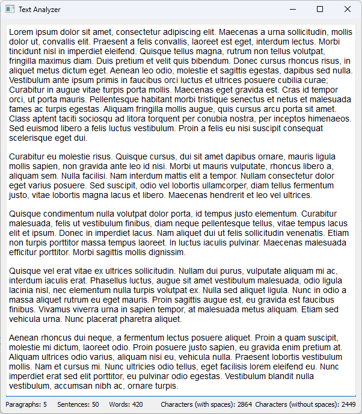

# Text Analyzer

## Description
A simple text analyzer application built with PyQt5 that displays the number of paragraphs, sentences, words, and characters (with and without spaces) in real-time as you type.

## How to Use
1. Clone the repository or download the source code.
```bash
git clone https://github.com/a-generation/Text-analyzer.git
cd Text-analyzer
```
2. Ensure you have Python and PyQt5 installed.
3. Run the application.
```bash
python main.py
```
4. Type or paste text into the text area and watch the statistics update in real-time.

## Requirements
- Python 3.x
- PyQt5

To install PyQt5, use the following command:
```bash
pip install PyQt5
```

## Features
- Real-time text analysis
  - Paragraph count
  - Sentence count
  - Word count
  - Character count (with spaces)
  - Character count (without spaces)

## License
This project is licensed under the MIT License - see the [LICENSE](LICENSE) file for details.
